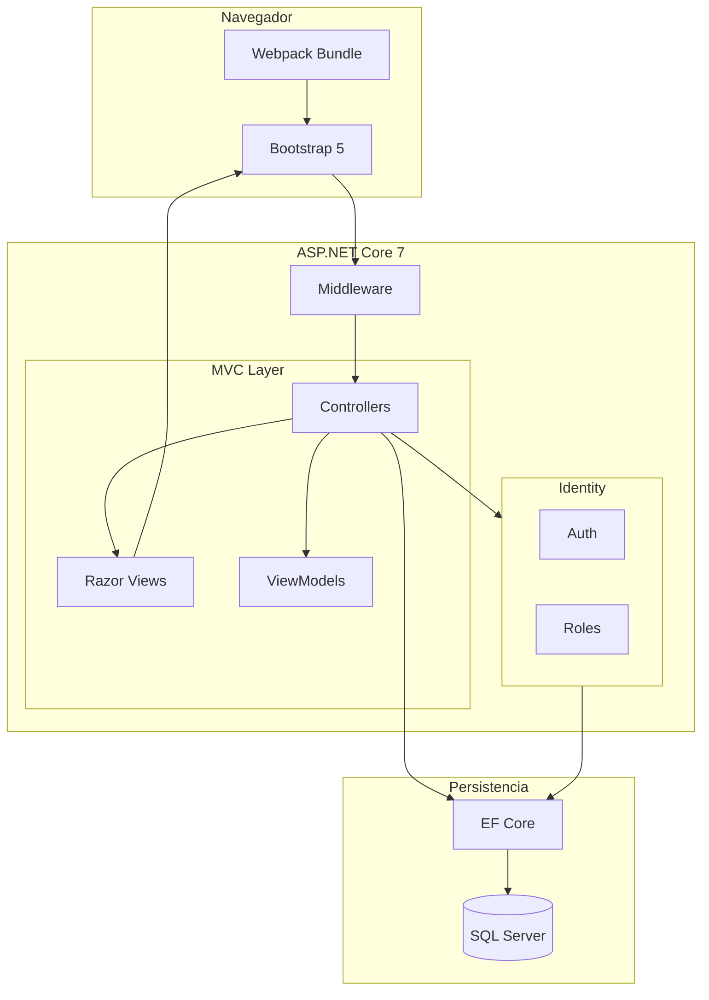

# 🎮 LostArkOffice

[](https://dotnet.microsoft.com/)
[](https://dotnet.microsoft.com/apps/aspnet)
[](https://docs.microsoft.com/ef/)
[](https://www.microsoft.com/sql-server)
[](https://getbootstrap.com/)
[](https://webpack.js.org/)
[](LICENSE)

[](https://en.wikipedia.org/wiki/Model%E2%80%93view%E2%80%93controller)
[](https://docs.microsoft.com/en-us/dotnet/architecture/modern-web-apps-azure/)
[](https://www.scrum.org/)
[](https://github.com/samuelhm/)

---

## 📝 Descripción

**LostArkOffice** es una plataforma web de gestión para gremios de *Lost Ark* que centraliza la organización de raids, el seguimiento de personajes y la coordinación de miembros. Resuelve el problema de dispersión de información en comunidades gaming mediante un sistema unificado de autenticación y administración de recursos del gremio.

---

## ✨ Características Principales

- **Autenticación Robusta** - Login/Registro con validación asíncrona de email y username, protección CSRF y gestión de sesiones persistentes
- **Autorización Basada en Roles** - Sistema de permisos granular con ASP.NET Core Identity (SuperAdmin, GremioAdmin, Usuario)
- **Gestión de Gremios** - CRUD completo de gremios con asignación de usuarios
- **Administración de Raids** - Creación de tipos (4/8 jugadores), programación con fechas y duración
- **Control de Personajes** - Sistema de clases, niveles (ItemLevel) y asociación con usuarios
- **Validación Frontend** - Verificaciones en tiempo real con JavaScript vanilla + Bootstrap

---

## 🛠️ Stack Tecnológico

| Capa | Tecnología |
|------|------------|
| **Backend** | ASP.NET Core MVC 7.0 |
| **ORM** | Entity Framework Core 7.0.13 |
| **Database** | SQL Server |
| **Auth** | ASP.NET Core Identity |
| **Frontend** | Bootstrap 5.3 + JavaScript ES6 |
| **Bundler** | Webpack 5.89 |

---

## 🏗️ Decisiones Técnicas

El proyecto adopta el patrón **MVC** para garantizar separación de responsabilidades y facilita rel mantenimiento a largo plazo. Se eligió **ASP.NET Core Identity** por ofrecer hashing de contraseñas, protección contra ataques de fuerza bruta y gestión de claims out-of-the-box, evitando vulnerabilidades comunes en implementaciones custom.

**Entity Framework Core** con enfoque Code-First permite versionar los cambios de esquema mediante migraciones, manteniendo sincronizados el modelo y la base de datos. La integración de **Webpack** moderniza el manejo de assets frontend sin abandonar la arquitectura .NET tradicional.

---

## 📊 Diagrama de Arquitectura



---

## 🚀 Getting Started

### Prerrequisitos

- [.NET 7.0 SDK](https://dotnet.microsoft.com/download/dotnet/7.0)
- [SQL Server](https://www.microsoft.com/sql-server) (LocalDB o instancia completa)
- [Node.js](https://nodejs.org/) v16+

### Instalación

```bash
git clone https://github.com/samuelhm/LostArkOffice.git
cd LostArkOffice
dotnet restore
npm install && npm run build
```

Configura `appsettings.json`:

```json
{
  "ConnectionStrings": {
    "DefaultConnection": "Server=(localdb)\\mssqllocaldb;Database=LostArkOffice;Trusted_Connection=True;TrustServerCertificate=true;"
  }
}
```

```bash
dotnet ef database update
dotnet run
```

Abre https://localhost:5001

---

## 📁 Estructura

```
LostArkOffice/
├── Controllers/
│   ├── AccountController.cs
│   ├── SuperAdminController.cs
│   └── HomeController.cs
├── Models/
│   ├── DataModels/ (EF Entities)
│   ├── ViewModels/
│   └── ApplicationDbContext.cs
├── Views/
│   ├── Account/
│   ├── SuperAdmin/
│   └── Shared/
├── src/
│   ├── index.js
│   └── ValidarFormularioRegister.js
├── Migrations/
└── Program.cs
```

---

## 📬 Contacto

**Samuel Hurtado**

[](https://github.com/samuelhm/)
[](https://www.linkedin.com/in/shurtado-m/)